# Collaborative RDF Graph Generator

The purpose of this software is to generate RDF graph from the triples with the features of
collaborative editing.The Main objective of the project to convert give set of the triples in to RDF Graphs. Give a User Authentication System to restrict only authorized users allowed to access to the software.
Also, the user can able to create multiple datasets and in each dataset, there should be able to
create multiples triples. Also, only triples approved by other registered users is converted to
RDF Graphs. Possibility to edit and delete the created triples. Using the software, the user can
able to invite new users or make discussion.

## Results 

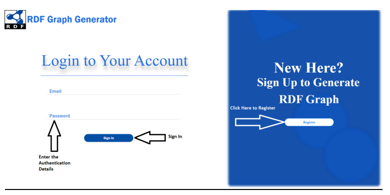
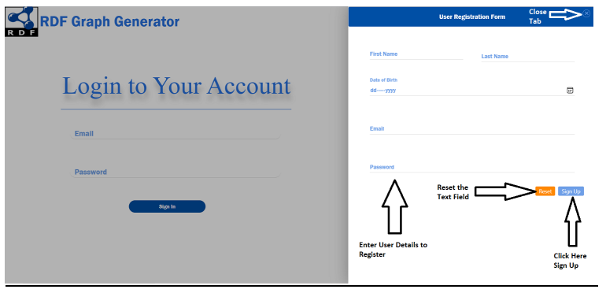

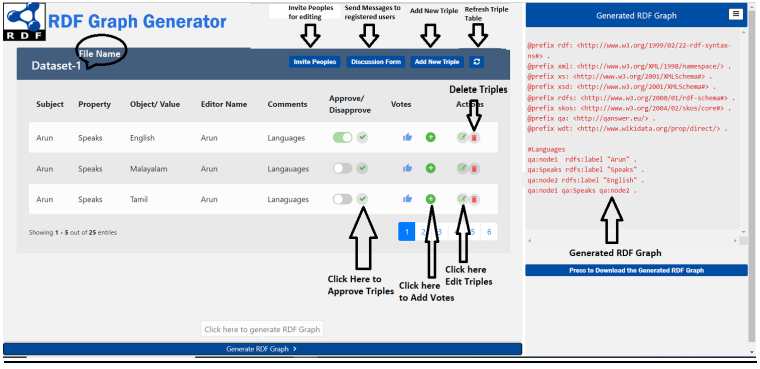
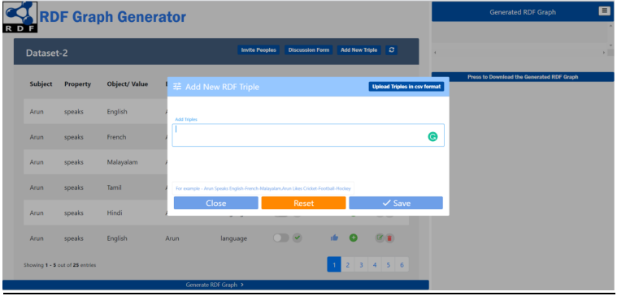
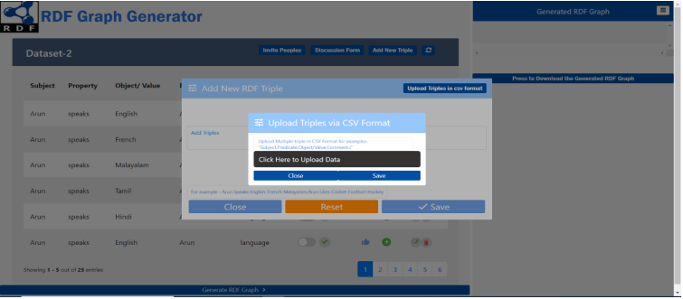
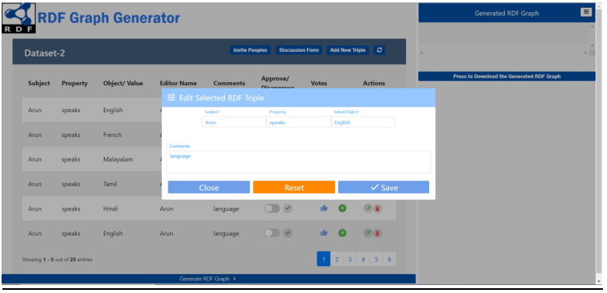
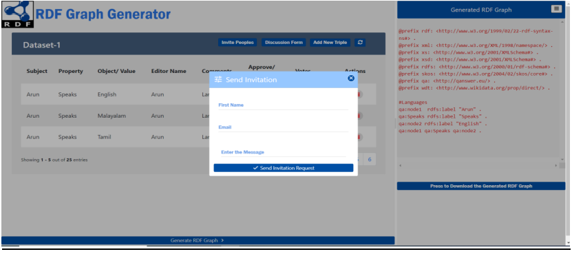
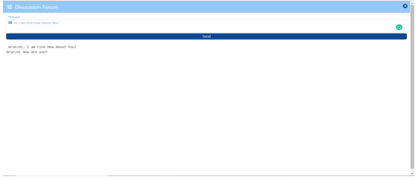

### Class diagram
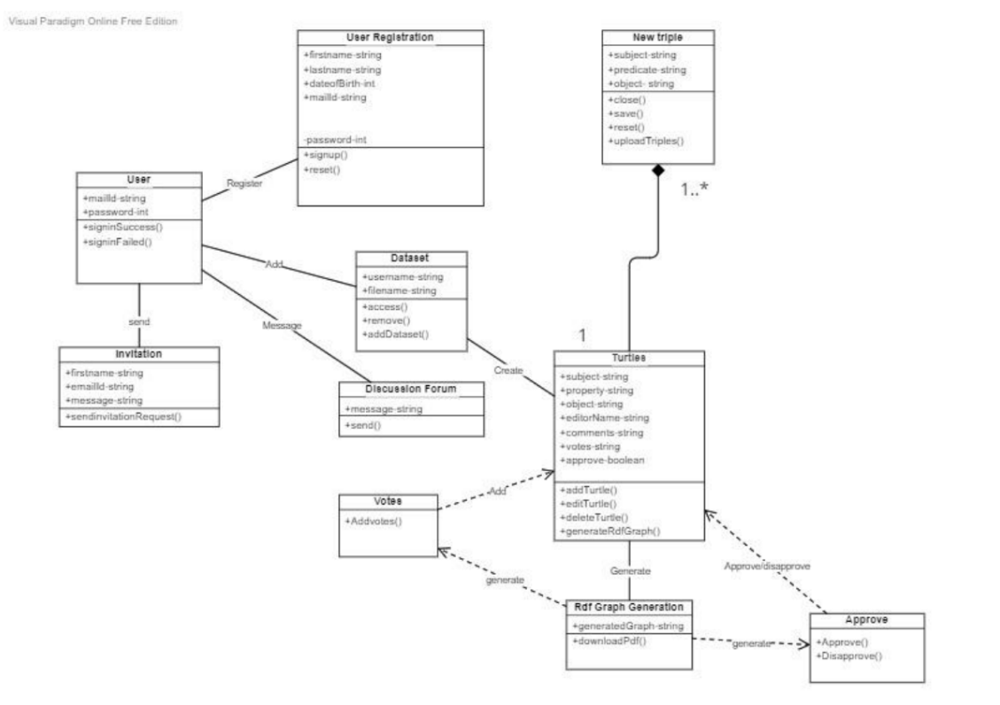

### Package diagram Client side 

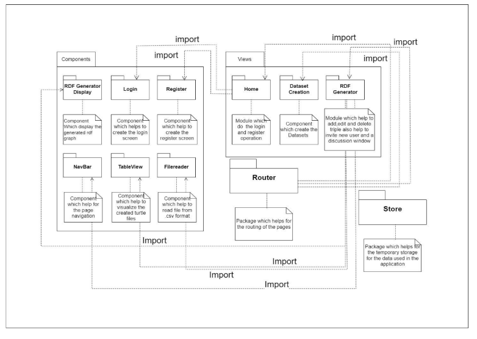

### Package diagram server side 

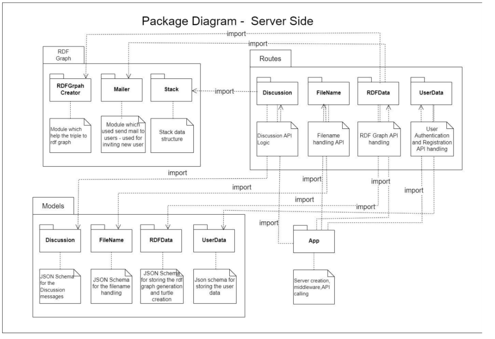

### Deployment diagram

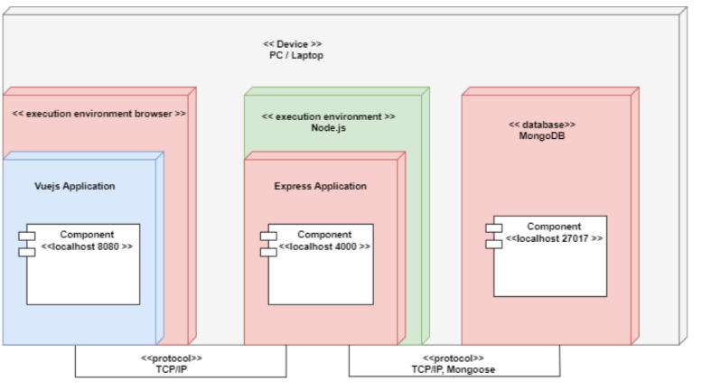

